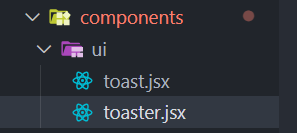
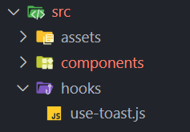

## Tutorial 
### Build And Deploy a Modern Personal Portfolio with ReactJS and TailwindCSS | React Beginner Tutorial
### PedroTech:  Author/Creator
[YouTube URL for Tutorial](https://www.youtube.com/watch?v=ifOJ0R5UQOc)

## Setup Environment

        npm create vite@latest

          ◇  Select a framework:
          │  React
          │
          ◇  Select a variant:
          │  JavaScript
          │
          ◇  Scaffolding project in C:\projects\portfolio-dvm...
          │
          └  Done. Now run:

            npm install
            npm run dev

### Libraries to install

#### Tailwindcss:

This is a new version of tailwind, v.4

        npm i tailwindcss @tailwindcss/vite // plugin

edit vite.config.js to import the plugin.

import tailwindcss from '@tailwindcss/vite' and add it to the plugin array

        import { defineConfig } from 'vite';
        import react from '@vitejs/plugin-react';
        import tailwindcss from '@tailwindcss/vite';

        // https://vite.dev/config/
        export default defineConfig({
          plugins: [react(), tailwindcss()],
        });

to src/index.css, or src/global.css add

        @import 'tailwindcss';

delete app.css and it's import into App.jsx

Also in vite.config.js, set up alias for the 'src' path name. Note: Need to import path as well

        import react from '@vitejs/plugin-react';
        import tailwindcss from '@tailwindcss/vite';
        import path from 'path';

        // https://vite.dev/config/
        export default defineConfig({
          plugins: [react(), tailwindcss()],
          resolve: {
            alias: {
              '@': path.resolve(__dirname, './src'),
            },
          },
        });

### Tailwind Merge

The tailwind-merge package 
allows us to create a util function to combine class names in tailwind.
The function is coded in  /lib/utils.js

#### Lucid React

An icon library, gives us access to icons for website.

### React Router DOM

Routing and page navigation library

        npm i lucide-react react-router-dom tailwind-merge

### Radix UI

a toaster and other files used in radix-ui. We will be able to copy and paste the component that radix provides

        npm i @radix-ui/react-toast class-variance-authority clsx

## Toaster Component
Create a src/components/ui folder and include toaster.jsx and toast.jsx 
Generated the library

Create src/hooks folder and include use-toaster.js
Generated from the library

## Defining the routes
1. Wrap the template in App.jsx with  '<BrowserRouter'

        function App() {
          return (
            <>
              <BrowserRouter>
                <Routes>
                  <Route index element={<Home />} />
                  <Route path="*" element={<NotFound />} />
                </Routes>
              </BrowserRouter>
            </>
          );
        }

    ## Custom Styling
    in src/index.css
    1. Delete  all the default styles
    2. Define theme.
    3. CSS Directives
   
  Tailwind CSS provides several directives to help developers manage and extend the framework's functionality. Here's an explanation of 
  @layer, @apply, and @utility:
  1. @layer
   - Purpose: The @layer directive is used to organize CSS rules into specific categories or "layers." This is crucial for controlling CSS specificity and ensuring that styles are applied as intended.
   - Layers: Tailwind CSS comes with predefined layers:
     - base: For global styles (e.g., resets, default HTML element styles).
     - components: For styles of reusable UI components (e.g., buttons, cards).
     - utilities: For single-purpose, atomic utility classes (e.g., text-center, m-2).
     - variants: For modifier styles, like hover, focus, etc.
     - screens: For responsive breakpoints
   - How it Works: By placing your CSS rules within a @layer, you tell Tailwind CSS how to prioritize those styles relative to Tailwind's own styles and other custom styles.
   - Example:
 - 
        @layer base {
            body {
              @apply font-sans bg-gray-100;
            }
          }
          @layer components {
            .btn {
              @apply px-4 py-2 rounded bg-blue-500 text-white;
            }
          }
          @layer utilities {
            .truncate-2 {
              overflow: hidden;
              display: -webkit-box;
              -webkit-line-clamp: 2;
              -webkit-box-orient: vertical;
            }
          }
          

1. @apply
      
   - Purpose: The @apply directive allows you to inline existing Tailwind CSS utility classes (or other CSS rules) within your own custom CSS. This promotes reusability and reduces redundancy in your CSS.How it Works: Instead of repeating the same set of utility classes in multiple CSS rules, you can define a custom CSS rule and use @apply to include those utility classes.Example:

          @layer components {
          .card {
            @apply bg-white rounded-lg shadow-md p-4;
          }
          .card-title {
            @apply text-xl font-semibold mb-2;
          }
}
In this example, the .card class will have the styles defined by the bg-white, rounded-lg, shadow-md, and p-4 utility classes.

3. @utility
   
   - Purpose: While not a directive you write directly, @utility refers to the layer where custom utility classes are defined.
   - How it Works: When you create your own single-purpose CSS classes and place them inside the @layer utilities block, Tailwind treats them similarly to its own utility classes. This means they can be used in your HTML and combined with other Tailwind utilities.Example:

        @layer utilities{
          .bg-gradient-blue{
            background-image: linear-gradient(to right, #6b7280, #374151);
          }
        }

  Now you can use the class bg-gradient-blue in your HTML.
  

  ## Email api for sending a message from the form.
  [Email.js](https://dashboard.emailjs.com/sign-in)
  There is a low cost $ 

 
## What does position relative do for this element

GitHub.copilot-chat.github.copilot.editor
used /explain (rerun without)
The position: relative CSS property applied to the <footer> element in your code allows you to position the element relative to its normal position in the document flow. Here's what it does:

Default Positioning: By default, the <footer> will remain in its normal position in the layout, as if position: static were applied.

Offset Adjustments: If you add properties like top, right, bottom, or left, the element will move relative to its original position. For example:

Stacking Context: position: relative also allows the element to act as a reference point for absolutely positioned child elements. If you add position: absolute to a child element, it will be positioned relative to this <footer>.

No Visual Change Without Offsets: In your current code, since no top, left, right, or bottom properties are specified, the position: relative has no visible effect. However, it might be there to prepare for future adjustments or to serve as a positioning context for child elements.

If you don't need this behavior, you can safely remove position: relative unless it's being used elsewhere in your CSS.